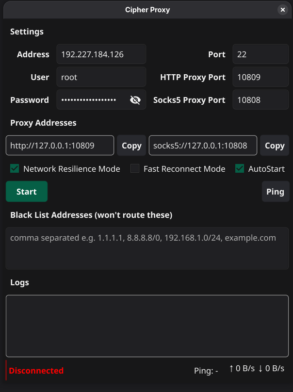

# Cipher Proxy

> Part of the **[cipher-proxy](https://github.com/cipher-proxy)** organization — a small community building open, privacy-respecting tunneling tools. Contributions and new members are welcome; see the org README to join and contribute.

**Cipher Proxy** is a purpose-built, single-server **SSH tunnel** that exposes a local
**SOCKS5** and **HTTP** proxy, written in Go with a native Fyne GUI (Linux/GNOME/KDE/XFCE,
and also built for macOS and Windows).

At its core it is **based on SSH**: it opens one SSH connection to a server you control and
tunnels all SOCKS5/HTTP proxy traffic through that encrypted SSH session. In other words,
your proxy traffic rides inside a normal SSH connection — no extra server software required
beyond a standard `sshd`.

It replaces solutions like `autossh -D` with faster, more predictable reconnect
behavior tailored for unstable networks: the local proxy listeners stay alive
permanently while only the underlying SSH client is swapped out, so clients never
see "connection refused" during a reconnect — they get a fast proxy error instead
of a long hang, and traffic resumes the instant the new SSH session is up.

## Screenshot



## Features

- **SOCKS5 + HTTP proxies** (`no auth` CONNECT) that tunnel all traffic through a
  single configured SSH server.
- **Active SSH keepalive pings** (not just TCP timeouts) to detect a dead session
  quickly, with two tuning profiles:
  - **Fast Reconnect Mode** — aggressive keepalive, declares death after a single
    missed ping, retries almost immediately. Best for sudden, clean drops.
  - **Network Resilience Mode** — longer keepalive, tolerates a few missed pings
    before declaring death (avoids reconnect storms on flaky links), slightly
    longer backoff. Best on unstable, lossy links.
- **Permanent local listeners** — only the SSH client reconnects; the SOCKS/HTTP
  sockets never rebind, so apps never fail with "connection refused".
- **Split-tunnel Black List** ("won't route these") — by default everything goes
  through the SSH tunnel; list specific domains / IPs / CIDR ranges to bypass the
  tunnel (connect directly).
- **GUI** (Fyne):
  - Settings (Address / Port / User / Password) and Outbound (HTTP & SOCKS5 ports).
  - Live **log panel** with a search box that filters lines by keyword.
  - **Status bar**: colored dot (green = connected, orange = retrying, red =
    disconnected), live ↑/↓ throughput, and a **Ping** readout (ms) to the server.
  - **AutoStart** checkbox: installs a GNOME autostart entry and auto-starts the
    proxy on launch.
  - One-click copy buttons for the proxy addresses (`http://127.0.0.1:<port>` and
    `socks5://127.0.0.1:<port>`).
- **Headless mode** (`--headless`) for scripted/terminal testing using the saved
  config — no GUI required.

## Install

One-line install (downloads the prebuilt Linux binary from the latest release and
installs it to `~/.local/bin`, plus a desktop launcher):

```bash
curl -fsSL https://raw.githubusercontent.com/cipher-proxy/cipher-proxy/main/installer.sh | bash
```

Or with `wget`:

```bash
wget -qO- https://raw.githubusercontent.com/cipher-proxy/cipher-proxy/main/installer.sh | bash
```

System-wide install to `/usr/local/bin` (needs sudo):

```bash
curl -fsSL https://raw.githubusercontent.com/cipher-proxy/cipher-proxy/main/installer.sh | bash -s -- --system
```

Then run it with `cipherproxy`.

## Build

Requires Go 1.26.4+ (see `go.mod`) and the Fyne CGO dependencies
(`base-devel mesa libx11 libxcursor libxrandr libxinerama libxi libxxf86vm`).

```bash
go build -o cipherproxy .
```

## Run

```bash
./cipherproxy            # GUI
./cipherproxy --headless # terminal mode (uses saved config)
```

Then configure the server and ports in the GUI, press **Start**, and point your
browser / `curl` at the shown proxy addresses.

Example (replace with your own server):

```bash
curl --proxy http://127.0.0.1:18888 https://ifconfig.me
curl --proxy socks5h://127.0.0.1:11080 https://ifconfig.me
```

> Note: for plain `socks5://` the client resolves the name locally; if it picks an
> address family your server cannot reach, use `socks5h://` (proxy-side DNS) or
> `curl -4`.

## Known limitations

- Host-key checking is disabled (`InsecureIgnoreHostKey`) — acceptable for a single
  personal server, but a strict-host-key option would be a good future improvement.
- The HTTP plain-forward path is simplified; `CONNECT` (used for HTTPS) is the
  well-tested path.

## Contributing

Contributions are very welcome! Open an issue or a pull request for bug fixes,
features, or documentation. Please keep `slog` for logging (no `fmt`/`log` for log
output) and run `go vet ./...` before submitting.

## License

MIT.
